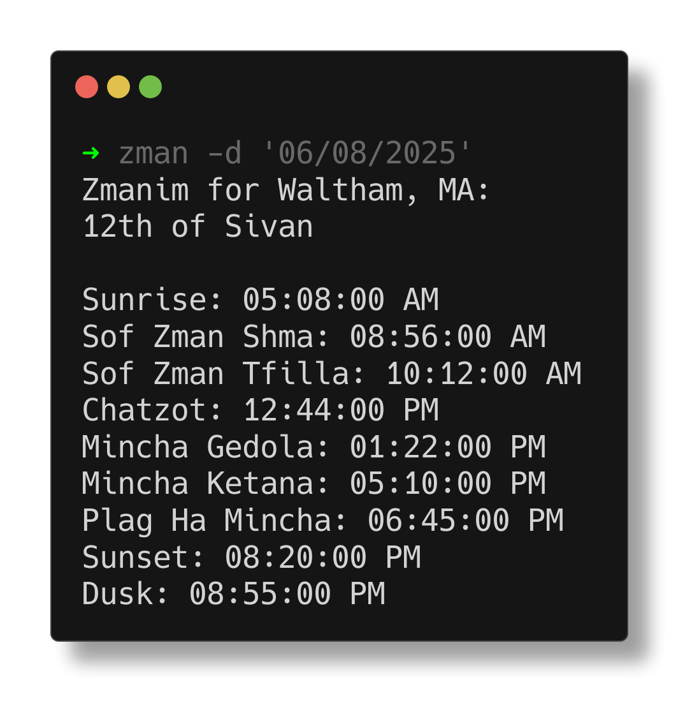
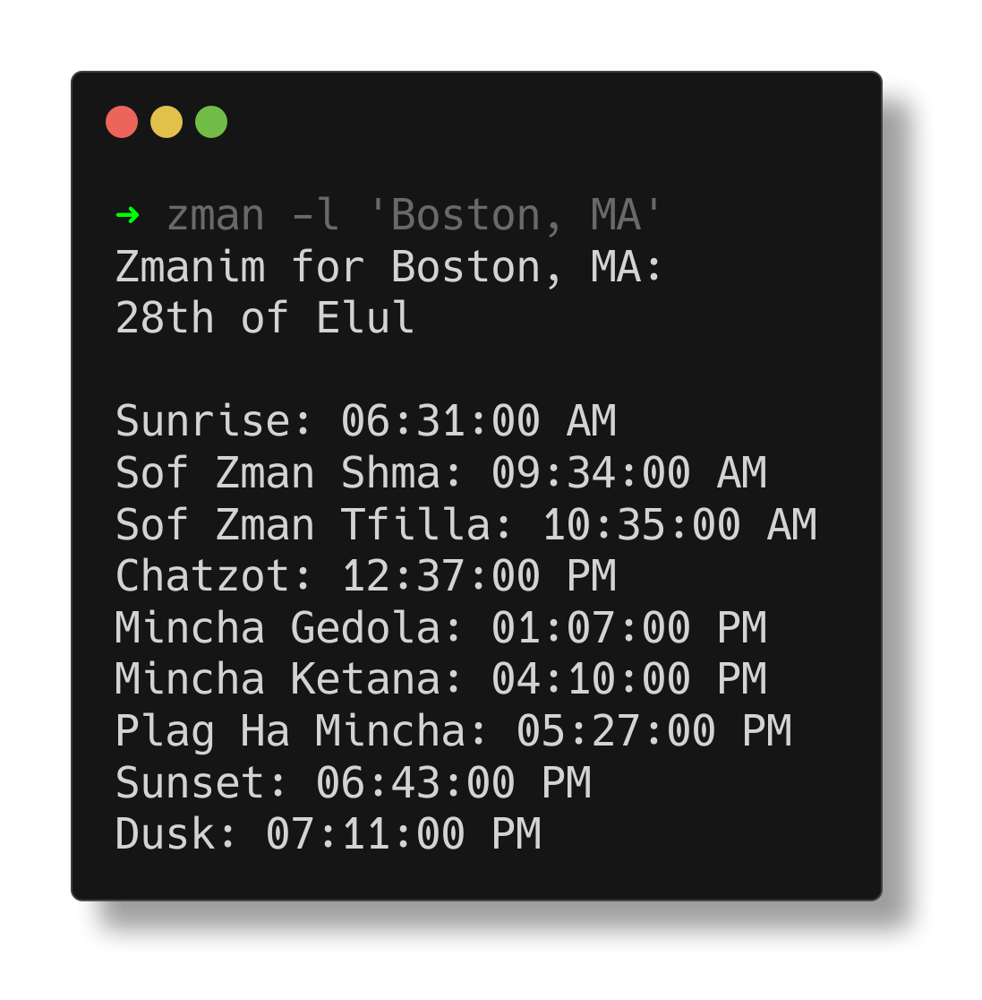

# Zman

A simple CLI Zmanim tool powered by Hebcal. 

(Are you coming from my resume? See the skills I used in this project [here](SKILLS.md))

## Features

- Zmanim and events (holidays, fasts, etc.) for any day at any location.
    - All zmanim provided in the hebcal API plus candle lighting are available
    - Candle lighting calculated based on a custom variable allowing for 18 min, 40 min or any other period.

## Installation

1. Clone this repo to an appropriate location and cd into the resulting directory

``` {bash}
git clone https://github.com/onegkg/Zman.git
cd Zman
```

2. Install using pip

``` {bash}
pip install .
```

3. Before using zman, you'll need to create a geonames.org api key. this is a free service that is used to convert plain
   text place names to a unique identifier that can be used in the hebcal API
    1. Create a free [geonames.org](https://www.geonames.org/login) account.
    2. Once you've created your account, navigate to your account page and turn on "Free Web Services" for your account.
    3. Create a `config.yaml` file at `$XDG_CONFIG_HOME/zman/` (if you run zman without a config file, it will tell you
       where to put the config file) and add your geonames user name under `APIs -> geonames_key`. A sample minimal
       config.yaml file is provided under [Sample Config](#sample-config)

4. Alternatively, you can avoid using the geonames API entirely by looking up the geonames key of your desired location
   on [geonames.org](https://www.geonames.org) and putting it in your config file under `Settings -> geonames_loc`

## Usage

- `zman` gives you the zmanim for the current day at the location from your config.


- `zman -d` or `zman --date`allows you to get the zmanim on a particular date. The date should be formatted as
  MM/DD/YYYY.



- `zman -l` or `zman --location` allows you to get the zmanim in a particular location.



- `zman -h` prints the help message.

## Configuration

### Sample Config

Configuration is done in a `config.yaml` file, which should be placed in `$XDG_CONFIG_HOME/zman/config.yaml`. A minimal
sample config is provided below.

``` {yaml}
APIs:
  geonames_key: "<your_geonames_username>" 

Settings:
  location: "Boston, MA" 
```

### Full Configuration

Below is the full `default_config.yaml`, any of these options can be overriden by the user in `config.yaml`.

``` {yaml}
Zmanim:
  chatzotNight: False
  alotHaShachar: True
  misheyakir: False
  misheyakirMachmir: False
  dawn: False
  sunrise: False 
  sofZmanShmaMGA19Point8: False
  sofZmanShmaMGA16Point1: False
  sofZmanShmaMGA: False
  sofZmanShma: True
  sofZmanTfillaMGA19Point8: False
  sofZmanTfillaMGA16Point1: False
  sofZmanTfillaMGA: False
  sofZmanTfilla: True
  chatzot: True
  minchaGedola: True
  minchaGedolaMGA: False
  minchaKetana: True
  minchaKetanaMGA: False
  plagHaMincha: True
  candleLighting: True
  sunset: True
  beinHaShmashos: False
  dusk: False
  tzeit7083deg: False
  tzeit85deg: True
  tzeit42min: False
  tzeit50min: False
  tzeit72min: False

APIs:
  geonames_key: "" # This field must be replaced with your geonames key before first usage

Settings:
  location: "New York, NY" # Plain text location to be fed to the geonames api. The API will attempt to guess the location with the provided information. It is recommended that you include a state or country code to help prevent mismatches.
  shabbat_start: 18 # The number of minutes before sunset shabbat starts. Should generally be set to 18 in chutz la'aretz and 40 in yerushalayim.
```

#### Zmanim

These are are all of the zmanim that are provided by the Hebcal API, I've set sane defaults, but you are welcome to
change any of them that you would like. Zmanim with MGA and numbers in their names may have their names formatted
weirdly, this is unintentional and will probably be fixed at some point.
